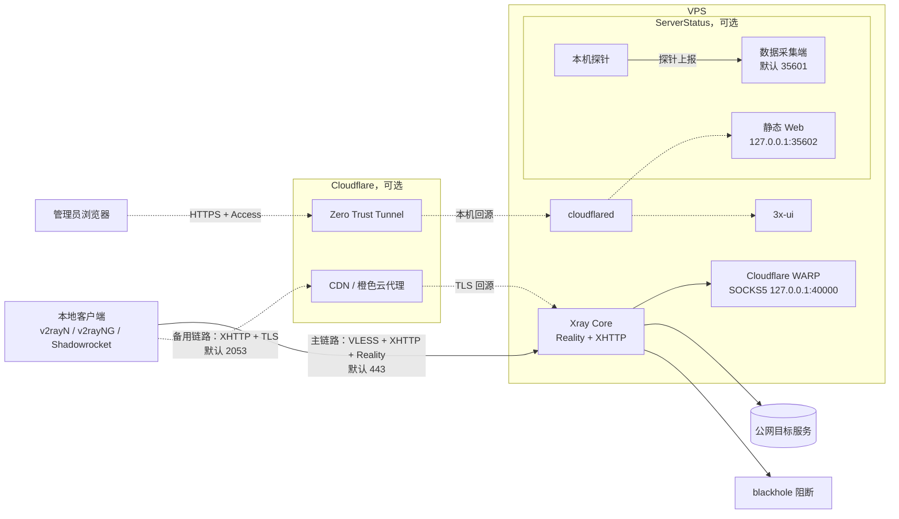
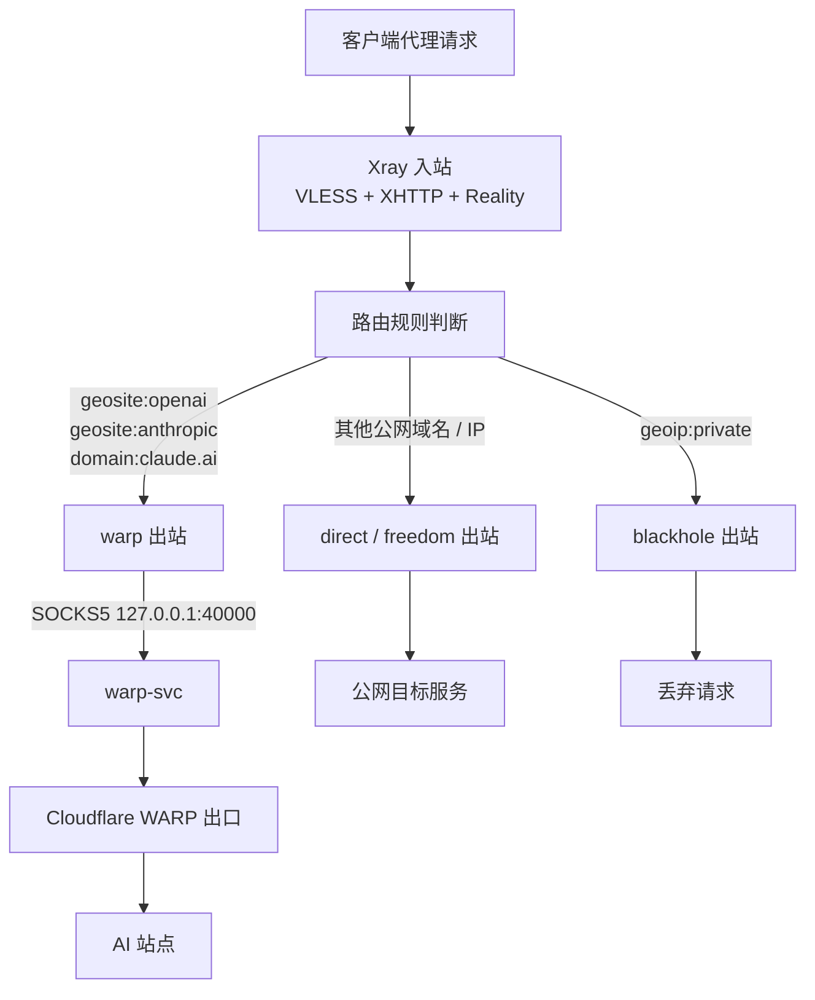

# vps-oneclick 一键部署

## 1. 项目介绍

洛杉矶 VPS 一键部署项目：Xray（XHTTP + Reality 主节点）为核心，默认包含 WARP AI 分流，可选 ServerStatus、3x-ui 和 cloudflared Tunnel。

### 运行模式与依赖

### 最小可用模式：不需要域名和 Cloudflare 配置

主节点使用 `VLESS + XHTTP + Reality`，只需要一台有公网 IP 的 Ubuntu / Debian VPS，并放行主节点端口（默认 `443`）。Reality 的 `REALITY_SNI` 是伪装目标域名，不是你必须购买的域名；默认 `www.samsung.com` 仅作为伪装站点使用。

使用下面的最小配置时，不会启用 CDN 备用节点，也不会接入 Cloudflare Tunnel。部署完成后会生成基于 VPS 公网 IP 的 `vless://` 链接，可直接导入客户端：

```bash
CDN_DOMAIN=""
TUNNEL_TOKEN=""
INSTALL_TUNNEL="0"
INSTALL_3XUI="0"
INSTALL_SERVERSTATUS="0"
```

注意：`30-warp.sh` 默认仍会安装 Cloudflare WARP，用于 AI 站点分流。它不需要 Cloudflare 账号或域名，但出口会经过 Cloudflare WARP 网络。如果你要求完全不用任何 Cloudflare 组件，还需要单独禁用 WARP 相关部署和路由。

### 可选组件的依赖区别

| 功能 | 是否需要自己的域名 | 是否需要 Cloudflare 配置 | 说明 |
|---|---|---|---|
| Reality 主节点 | 不需要 | 不需要 | 核心代理功能，使用 VPS 公网 IP 生成客户端链接 |
| WARP AI 分流 | 不需要 | 不需要账号/域名 | 默认安装并分流 AI 站点；出口依赖 Cloudflare WARP 网络 |
| CDN 备用节点 | 需要 | 需要 DNS 和 SSL 配置 | `CDN_DOMAIN` 留空时不启用 |
| ServerStatus 本机部署 | 不需要 | 不需要 | `INSTALL_SERVERSTATUS="1"`；Web 默认监听本机，可用 SSH 隧道访问 |
| ServerStatus 客户端 | 不需要 | 不需要 | `INSTALL_SERVERSTATUS="2"`；上报目标可以是已有服务器的 IP |
| 3x-ui 本机部署 | 不需要 | 不需要 | `INSTALL_3XUI="1"`；本机访问可通过 SSH 隧道 |
| Cloudflare Tunnel | 需要 Cloudflare 域名 | 需要 Zero Trust / Tunnel token | 用于把面板安全发布到公网；不影响代理主链路 |

ServerStatus 本机 Web 端口默认是 `127.0.0.1:35602`。没有 Tunnel 时，可先建立 SSH 隧道再访问：

```bash
ssh -L 35602:127.0.0.1:35602 root@服务器IP
```

然后在本机浏览器打开 `http://localhost:35602`。

## 2. 原理图、流程图

### 架构原理图

下图展示核心代理组件与可选面板组件的关系。实线是代理主链路；虚线是可选管理、监控或备用链路。



核心部署只需要 `C → X → NET` 这条主链路。CDN、Tunnel、ServerStatus 和 3x-ui 都是可选能力；关闭这些组件不会影响 Reality 主节点。

### 数据流程图

下图展示客户端请求进入 Xray 后的路由判断。响应沿原链路反向返回。



对应的服务端规则是：

- AI 域名命中 `warp` 出站，避免 VPS 原始出口被风控。
- 其他普通公网流量命中 `direct / freedom` 出站。
- 私有网段命中 `blackhole`，阻止通过代理扫描或访问内网。

## 3. 使用方式

### 在线一键安装

在全新 VPS 上执行：

```bash
curl -fsSL https://raw.githubusercontent.com/wwddcc/vps-oneclick/master/install.sh \
  | sudo bash -s -- --minimal --timezone Asia/Shanghai --run
```

`--minimal` 会生成最小可用配置：只部署 Reality 主节点，不启用 CDN、Tunnel、3x-ui 和 ServerStatus。部署完成后终端会输出 `vless://` 链接和二维码。

生产环境建议固定版本并校验源码包：

```bash
curl -fsSL https://raw.githubusercontent.com/wwddcc/vps-oneclick/master/install.sh \
  | sudo bash -s -- \
    --version v1.0.0 \
    --sha256 替换为源码包SHA256 \
    --minimal \
    --timezone Asia/Shanghai \
    --run
```

默认安装目录是 `/opt/vps-oneclick`。重复执行会备份旧目录，但保留其中已有的 `config.env`。使用 `--no-run` 可以只下载和准备配置：

```bash
curl -fsSL https://raw.githubusercontent.com/wwddcc/vps-oneclick/master/install.sh \
  | sudo bash -s -- --minimal --no-run
```

`curl | bash` 会以 root 执行远端脚本；请只从本仓库官方地址获取，生产环境优先使用固定版本和 SHA-256 校验。

### 手动上传安装

```bash
# 1. 从模板创建本地配置（真实配置不提交）
Copy-Item config.env.example config.env   # PowerShell
# Linux / macOS 使用：cp config.env.example config.env
notepad config.env        # 或 vim

# 2. 上传到服务器
scp -r vps-oneclick root@服务器IP:/opt/

# 3. 一键部署
ssh root@服务器IP
cd /opt/vps-oneclick && sudo bash deploy.sh
```

部署完成后终端会直接打印 `vless://` 分享链接和二维码，复制进 v2rayN「从剪贴板导入」，或用 v2rayNG / Shadowrocket 扫码即可测试。

部署完成后会生成 `output/deployment-report.md`（权限 600），汇总访问地址、账号密码、可选组件状态和验证步骤：

```bash
cat /opt/vps-oneclick/output/deployment-report.md
```

### config.env 说明

| 变量 | 默认 | 说明 |
|---|---|---|
| REALITY_SNI | www.samsung.com | Reality 伪装站点，需支持 TLS1.3 + H2 |
| REALITY_PORT | 443 | 主节点端口 |
| CDN_DOMAIN | 空 | 填域名启用 CDN 备用节点（A 记录 + 橙色云） |
| CDN_PORT | 2053 | CDN 备用端口，需为 CF 支持的 HTTPS 端口 |
| INSTALL_SERVERSTATUS | 1 | `0` 不安装；`1` ServerStatus 服务端 + 本机探针；`2` 仅探针客户端 |
| INSTALL_3XUI | 1 | 3x-ui 管理面板 |
| INSTALL_TUNNEL | 1 | cloudflared Tunnel |
| TUNNEL_TOKEN | 空 | Zero Trust Tunnel token，填入后自动接入 |
| PANEL_PUBLIC_DOMAIN | 空 | 3x-ui 面板域名，用于生成报告里的 HTTPS 地址 |
| STATUS_PUBLIC_DOMAIN | 空 | ServerStatus 面板域名，用于生成报告里的 HTTPS 地址 |
| SSH_PORT | 22 | SSH 端口，ufw 会自动放行 |
| TIMEZONE | America/Los_Angeles | 系统时区；必须使用 IANA 时区名，例如 `Asia/Shanghai` |
| SS_SERVER | 空 | 仅 `INSTALL_SERVERSTATUS=2` 时必填，已有 ServerStatus 服务端 IP / 域名 |
| SS_PANEL_PORT | 35601 | ServerStatus 探针上报端口；模式 `1` 为本机端口，模式 `2` 为远端服务端端口 |
| SS_WEB_PORT | 35602 | ServerStatus 静态面板端口，仅模式 `1` 使用 |

所有密钥类变量（UUID、x25519 密钥对、shortId、面板账号密码）留空即可，首次部署自动生成并保存在服务器 `/etc/vps-oneclick/secrets.env`，重复执行 `deploy.sh` 不会更换，客户端无需重新导入。

#### TIMEZONE 怎么定

`TIMEZONE` 必须填写 Linux 常用的 **IANA 时区名**，格式是 `区域/城市`，不要写 `GMT+8`、`UTC+8` 或中文描述。

`config.env.example` 默认使用 `America/Los_Angeles`；如果这个变量为空或没有设置，脚本会退回使用 `Asia/Shanghai`。

合法示例：

```bash
TIMEZONE="Asia/Shanghai"          # 中国标准时间
TIMEZONE="Asia/Tokyo"             # 日本时间
TIMEZONE="America/Los_Angeles"    # 美国洛杉矶时间
TIMEZONE="Etc/UTC"                # UTC
```

不确定服务器应使用哪个时区时，建议按用途选择：

- 想让部署日志、面板时间和北京时间一致：使用 `Asia/Shanghai`。
- VPS 在美国洛杉矶，且希望系统日志跟随机房时间：使用 `America/Los_Angeles`。
- 服务器跨地区协作或只需要统一基准时间：使用 `Etc/UTC`。

不要凭记忆猜测城市名。可以先在 VPS 上查询合法值：

```bash
timedatectl list-timezones

# 按关键字筛选
timedatectl list-timezones | grep -E 'Asia/(Shanghai|Tokyo)|America/Los_Angeles|Etc/UTC'
```

选择后写入 `config.env`：

```bash
TIMEZONE="Asia/Shanghai"
```

`10-init.sh` 部署时会执行：

```bash
sudo timedatectl set-timezone "$TIMEZONE"
```

部署后可以确认：

```bash
timedatectl
```

输出中的 `Time zone` 应显示你配置的值。注意：如果时区名写错，当前脚本不会中断部署，而是保留系统原时区；所以上线前建议先确认名称存在。

#### ServerStatus 安装模式

- `INSTALL_SERVERSTATUS="1"`：在当前服务器安装数据收集服务端、静态面板和本机探针。
- `INSTALL_SERVERSTATUS="2"`：当前服务器只安装探针客户端，并上报到已有 ServerStatus 服务端。必须填写：

```bash
INSTALL_SERVERSTATUS="2"
SS_SERVER="主服务器IP"
SS_PANEL_PORT="35601"
SS_USER="主服务器分配的节点用户名"
SS_PASS="主服务器分配的节点密码"
```

### Cloudflare 相关配置

以下内容全部用于可选增强能力；只部署 Reality 主节点时可以完全跳过这一节。

#### CDN 备用节点

1. DNS 添加 A 记录：`la.example.com` -> 服务器 IP，开启橙色云
2. SSL/TLS 模式设为 **Full**（用脚本生成的自签证书）或 **Full (strict)**（推荐，用 Origin 证书）
3. Origin 证书：面板 -> SSL/TLS -> Origin Server -> Create Certificate，下载 `cert.pem` / `key.pem` 放到项目目录后部署

#### Zero Trust Tunnel

1. Zero Trust 后台 -> Networks -> Tunnels -> Create tunnel（Cloudflared 类型）
2. 复制 token 填入 `config.env` 的 `TUNNEL_TOKEN`，重跑 `deploy.sh`
3. Public Hostname 配置：
   - `panel.example.com` -> `http://127.0.0.1:<PANEL_PORT>/<PANEL_PATH>`
   - `status.example.com` -> `http://127.0.0.1:35602`
4. 两个 hostname 都加 Access 策略，限定你的 Google 邮箱登录

## 4. 运维命令

### 重复部署 / 迁移新机器

- 同一台机器重跑 `deploy.sh`：幂等，密钥复用，只刷新配置
- 全新机器：重新上传项目 + `deploy.sh`，生成全新密钥，导入新链接即可

### 添加探针节点（其他服务器）

新 VPS 的探针要显示在面板上，分两步：先在主服务器登记节点，再在新服务器安装客户端。

#### 1. 主服务器登记节点

```bash
cd /opt/vps-oneclick
sudo bash scripts/add-serverstatus-node.sh --name "东京-备用" --client-ip 新VPS公网IP --location Tokyo --region JP
```

脚本会生成独立凭据写入 `/usr/local/ServerStatus/server/config.json` 并重启采集端、ufw 按源 IP 放行 35601/tcp、凭据追加到 `/etc/vps-oneclick/secrets.env`，最后打印新服务器上要执行的安装命令。

#### 2. 新服务器安装探针

```bash
# 本地或主服务器上传客户端脚本
scp scripts/deploy-status-client.sh root@新VPS:/root/

# 在新 VPS 上执行（直接复制第 1 步打印的命令）
sudo bash deploy-status-client.sh --server 主服务器IP --port 35601 --user node_xxx --password xxxx
```

脚本会下载 Hotaru 探针、注入连接信息、注册 `serverstatus-probe` 服务（开机自启），并自检端口连通性与凭据是否被采集端接受。

#### 管理节点

```bash
# 查看已登记节点的凭据（主服务器）
grep SS_NODE /etc/vps-oneclick/secrets.env

# 移除节点（主服务器）：编辑 config.json 删除对应 entry 后重启，并回收防火墙规则
nano /usr/local/ServerStatus/server/config.json
systemctl restart serverstatus
ufw delete allow from 新VPS_IP to any port 35601 proto tcp

# 新 VPS 卸载探针
systemctl disable --now serverstatus-probe
rm -rf /usr/local/ServerStatus-client /etc/systemd/system/serverstatus-probe.service
```

注意：Hotaru 探针协议为明文传输凭据，35601 仅对指定源 IP 开放；更换凭据后需要在新 VPS 重跑安装命令。

### 常用排查

```bash
systemctl status xray                 # Xray 主服务
journalctl -u xray -n 50 --no-pager   # Xray 日志
systemctl status warp-svc             # WARP 服务
warp-cli status                       # WARP 状态
curl --socks5-hostname 127.0.0.1:40000 https://www.cloudflare.com/cdn-cgi/trace
# 输出 warp=on 即 WARP 出口正常

systemctl status serverstatus serverstatus-probe serverstatus-web   # 探针 / 面板
systemctl status x-ui cloudflared                  # 面板 / 隧道
cat /etc/vps-oneclick/secrets.env                  # 所有生成密钥
cat output/client-links.txt                        # 客户端链接
```

## 5. 其它说明

### 安全说明

- 防火墙默认仅放行 SSH / 443 / 2053；添加远程探针节点时按源 IP 放行 35601/tcp（见「添加探针节点」）
- fail2ban 默认保护 SSH
- 私有 IP 段访问已在 Xray 路由中阻断，避免代理被用来扫描内网
- `output/` 和 `secrets.env` 已在 `.gitignore` 中，密钥文件权限 600

### 本地校验

```bash
# Bash 语法检查（需要 Git Bash / WSL / Linux）
for f in deploy.sh scripts/*.sh; do bash -n "$f" && echo "OK: $f"; done

# Xray 配置模板渲染校验
python tests/test_render.py
```

### 许可证

本项目代码采用 [MIT License](LICENSE) 发布。

部署脚本下载或安装的第三方组件（如 Xray、Cloudflare WARP、ServerStatus、3x-ui、cloudflared）仍分别适用其原始许可证。
